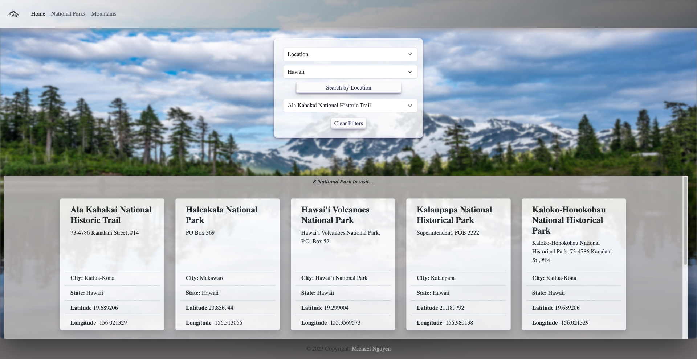

# Enjoy-the-Outdoors Project
A website for users to search for National Parks and Mountains with Javascript. On the National Parks page, the user may choose the search filter by location or park type to display more information with a click of a button. Mountain page will display all mountains on load and can select one mountain to pop up a modal to display.

# Project Preview

### Homepage


### National Parks Page


### Mountain Page


# Built With

* [HTML](https://developer.mozilla.org/en-US/docs/Web/HTML)
* [CSS](https://developer.mozilla.org/en-US/docs/Web/CSS)
* [Javascript](https://developer.mozilla.org/en-US/docs/Web/JavaScript)
* [Bootstrap](https://getbootstrap.com/docs/5.3/getting-started/introduction)

# Code Hightlight

Learned a new method called .includes() which is used to check if the selected state value is true during the loop through each object. If true, it'll return every object that passed the condition into a new array.
```javascript
function parksOnStateSelect() {
    
    const statesValue = document.getElementById('states').value;
    // loops thru every element using .include method to check if statesValue in key.State is true;
    const filteredParkData = nationalParksArray.filter((key) => key.State.includes(statesValue));
    
    return filteredParkData; // output: new array of objects that passed the condition
}
```
This function grabs the filteredParkData and looped to append National Park Names to a dropdown that contains the selected state.
```Javascript
// function used to update available park names when button is clicked
function updateParksOnLocationSelect() {
    const stateSelectValue = document.getElementById('states').value;
    const nationalParksList = document.getElementById('nationalParks');
    // grab the new parks array and store in variable to loop 
    const filteredParks = parksOnStateSelect();
    
    // appends a new option of every locationName
    filteredParks.forEach((element) => {
        if (stateSelectValue === element.State) {
            let updatedOptions = new Option(element.LocationName, element.LocationName)
            nationalParksList.appendChild(updatedOptions);
        }
    })
}
```
```Javascript
//* call this function to display the selected national park name
function displaySelectedParkName() {

    const getParkName = document.getElementById('nationalParks').value;

    nationalParksArray.forEach((park) => {
        if (park.LocationName === getParkName) {
            document.getElementById('myParks').innerHTML = `
            <div class="card border shadow" style="width: 18rem; margin: 5px;">
            <div class="card-body">
            <h5 class="card-title"><strong> ${park.LocationName}</strong></h5>
            <p class="card-text"> ${park.Address}</p>
            </div>
            <ul class="list-group list-group-flush">
            <li class="list-group-item"><strong>City:</strong> ${park.City}</li>
            <li class="list-group-item"><strong>State:</strong> ${park.State}</li>
            <li class="list-group-item"><strong>Latitude</strong> ${park.Latitude}</li>
            <li class="list-group-item"><strong>Longitude</strong> ${park.Longitude}</li>
            </ul>
        </div>`
        }
        else {
            return;
        }
    })
}
```
```Javascript
    // onchange event for when user selects a new park name
    const onParkChange = document.getElementById('nationalParks');
    onParkChange.onchange = () => {
        clearDisplay.innerHTML = ''
        displaySelectedParkName();
    }
```

# Author

Michael Nguyen
- [Link to Github](https://github.com/MichaelNguyenTT)

# License

This project is licensed under the MIT License 

## Acknowledgements

* Year Up Colleagues
* Remsey Mailjard - Pluralsight Instructor
* Bootstrap v5.3.2
* [MDN web docs](https://developer.mozilla.org/en-US/docs/Web/JavaScript)
* [Youtube](https://www.youtube.com/)
