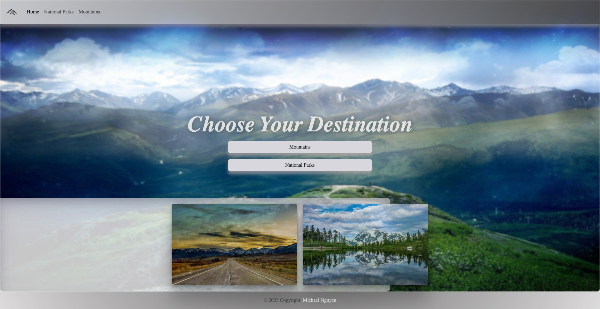

# Enjoy-the-Outdoors Project
A website for users to search for National Parks and Mountains with Javascript. On the National Parks page, the user may choose the search filter by location or park type to display more information with a click of a button. Mountain page will display all mountains on load and can select one mountain to pop up a modal to display.

# Project Preview

### Homepage

### National Parks Page

### Mountain Page

# Built With

* [HTML](https://developer.mozilla.org/en-US/docs/Web/HTML)
* [CSS](https://developer.mozilla.org/en-US/docs/Web/CSS)
* [Javascript](https://developer.mozilla.org/en-US/docs/Web/JavaScript)
* [Bootstrap](https://getbootstrap.com/docs/5.3/getting-started/introduction)

# Code Hightlight

# Author

Michael Nguyen
- [Link to Github](https://github.com/MichaelNguyenTT)

# License

This project is licensed under the MIT License 

## Acknowledgements

* Year Up Colleagues
* Remsey Mailjard - Pluralsight Instructor
* Bootstrap v5.3.2
* [MDN web docs](https://developer.mozilla.org/en-US/docs/Web/JavaScript)
* [Youtube](https://www.youtube.com/)
